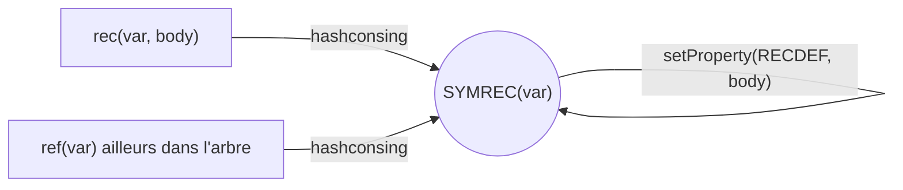

# Tree Rewrite Specification

::: toc+
- **Situation actuelle** — l'existant : `tmap`, `substitute`, le prototype de benchmark.
- **Objectifs** — les garanties que la nouvelle primitive doit tenir.
- **Non-objectifs** — ce qui reste hors perimetre.
- **Rec et ref : un seul cas a traiter** — pourquoi `ref(var)` n'a pas besoin d'un cas separe.
- **API proposee** — signature de `treeRewrite` (la variante en place a ete retiree).
- **Semantique bottom-up** — l'algorithme complet, cas ordinaire et cas `rec`.
- **Reecriture gardee par annotation** — R1/R2 : regles a premisse sur le terme source, garde top-down `pre` + regle bottom-up `post`.
- **La famille appariee `treeRewritePaired`** — regle `rule(original, rebuilt)`, memo expose, couture `defRule` sur les definitions recursives.
- **Proprietes** — ce qui survit ou non a une reecriture.
- **Composition des passes : regles librement, folds en pipeline** — pourquoi l'imbrication d'un fold dans une regle n'a pas de table coherente, et la regle qui en decoule.
- **Relation avec tmap** — migration de l'usage historique.
- **Exemple** — negation des nombres.
- **Tests attendus** — la checklist de correction.
- **Benchmarks attendus** — la checklist de performance.
- **Questions ouvertes** — les decisions encore a prendre.
:::

Ce document specifie une primitive de reecriture d'arbres pour `tlib`,
volontairement restreinte : arbres **symboliques** uniquement (pas de
representation de Bruijn), traversal **bottom-up** uniquement. L'objectif
est de remplacer les patterns ad hoc historiques (`tmap`, `substitute`, et un
prototype de benchmark aujourd'hui disparu) par une primitive locale et
correcte vis-a-vis du partage et des recursions symboliques. Etat : les trois
familles sont implementees (`tlib/rewrite.hh` — simple, gardee `pre`/`post`,
appariee `treeRewritePaired`), testees (`checkRewrite`, `checkGuardedRewrite`)
et mesurees (section `[rewrites]` de benchmark.cpp).

Ce document occupe l'etage intermediaire d'une pile documentaire. En
dessous, le README decrit les invariants des arbres que la presente spec
suppose acquis : hash-consing a partage maximal, recursion symbolique
`SYMREC`/`RECDEF`, alpha-equivalence. Au-dessus, les deux non-objectifs
« strategie fixe-point » et « calcul d'attributs dependant du contexte »
sont couverts par une specification separee de calcul bottom-up
d'attributs, developpee dans la bibliotheque `signals`, qui consomme la
presente primitive pour sa loi de reconstruction et fournit en retour les
jugements (types, intervalles) que consulte la variante gardee `pre`/`post`.

## Situation actuelle

Il existe deja plusieurs formes de transformation :

- `tmap(key, f, t)` : parcours bottom-up generique avec memoisation par
  propriete persistante sur les arbres.
- `substitute(t, id, val)` : remplacement structurel specialise, memoise par
  une propriete sous cle fraiche a chaque appel. La cle est unique mais les
  entrees, elles, restent attachees aux arbres apres l'appel : le commentaire
  du type `plist` dans `tree.hh` documente un cas reel ou un seul noeud
  accumule des dizaines de milliers de proprietes venant precisement de ce
  schema (`substitute()`/`liftn()`). C'est l'argument le plus concret en
  faveur du memo local.
- `negateNumbersSymbolicRec`, un prototype de reecriture locale avec
  `std::unordered_map<Tree, Tree>` qui vivait dans `benchmark.cpp` : il a
  valide l'approche (un seul cas `isRec`, jamais `isRef` — voir *Rec et ref*
  plus bas) selon la semantique `InPlace`, et a ete remplace par les
  primitives implementees.

(`lift`, `deBruijn2Sym`, `sym2deBruijn` existent aussi dans la bibliotheque
mais concernent la representation de Bruijn, hors perimetre de cette spec.)

Le besoin commun : parcourir un DAG de `Tree` en preservant le partage,
reconstruire seulement les noeuds modifies, memoiser localement, et traiter
correctement `rec(var, body)`.

## Objectifs

- **Semantique constructive (context-free)** : le resultat de `rule` sur un
  noeud `t` ne depend que de `t` (et de ses branches deja transformees),
  jamais du contexte ou du chemin par lequel `t` est atteint. C'est cette
  propriete qui rend valide le memo `Tree -> Tree`.
- **Memo local par appel** : aucun cache permanent par propriete.
- **Partage preserve** : un sous-arbre vu plusieurs fois pendant un appel est
  transforme une seule fois, le resultat est partage.
- **Reconstruction minimale** : si rien ne change, le resultat est exactement
  le meme pointeur — sauf pour `treeRewrite` sur un noeud `rec`, ou une variable
  fraiche est toujours creee (voir *Semantique bottom-up*) : la purete y
  prime sur l'identite de pointeur.
- **Recursion symbolique correcte** : traiter `rec(var, body)` sans dupliquer
  le travail ni boucler, avec un choix explicite sur ce qu'il advient de la
  variable et du partage de l'ancienne definition.
- **Compatible hash-consing** : toute reconstruction passe par `tree(...)`,
  `rec(...)`.

## Non-objectifs

- un moteur de reecriture par patterns ;
- une strategie fixe-point ;
- ~~un mode top-down~~ — **revise** : l'elagage top-down n'est pas qu'une
  optimisation. Le portage de la propagation de constantes du compilateur
  Faust a montre qu'une regle dont la premisse est un *jugement sur le terme
  source* (un type, un intervalle) ne peut pas s'exprimer en bottom-up pur :
  la premisse ne survit pas a la reconstruction. D'ou la variante gardee
  `pre`/`post` (voir *Reecriture gardee par annotation*). Le bottom-up seul
  reste la forme recommandee pour les regles purement structurelles ;
- la representation de Bruijn (`rec(body)` / `ref(n)`, aperture, `isClosed`) ;
- un `RewriteContext` expose a l'utilisateur : la regle de base a exactement
  la signature de `tfun` (`Tree(Tree)`) ; la variante gardee ajoute un
  callable (`pre : Tree -> std::optional<Tree>`, `post` gardant la signature
  simple), la famille appariee change la regle en `Tree(Tree, Tree)` —
  toujours sans objet contexte ;
- du calcul d'attributs dependant du contexte (compter des occurrences,
  threader un environnement comme `sym2deBruijnReady`) : ces calculs ont
  besoin d'une memoisation `(Tree, contexte) -> resultat`, hors de portee
  d'un `Tree -> Tree` local.

## Rec et ref : un seul cas a traiter

::: note [`ref(var)` n'est pas un cas separe]
Le hash-consing porte sur `SYMREC(var)` seul : `RECDEF` est une propriete, pas
un critere d'egalite. `rec(var, body)` et tout `ref(var)` construit ailleurs
avec le meme `var` sont **le meme pointeur** `Tree` (`recursive-tree.cpp`,
lignes 162-182). Consequence directe : la traversee n'a besoin que d'un seul
cas, `isRec(t, var, body)` — jamais d'un cas `isRef` separe. La premiere fois
que `t` est rencontre, on le traite comme une definition (on en extrait le
corps via `RECDEF`) ; toute occurrence suivante de ce meme pointeur — qu'elle
soit une reference recursive dans son propre corps ou une autre apparition
partagee ailleurs dans l'arbre — est deja dans le memo local et y est
resolue directement. C'est exactement ce que font
`treeRewriteMemo` (`tlib/rewrite.hh`), qui n'appelle jamais `isRef`.


:::

## API proposee

```cpp
// Cree une variable fraiche a chaque rec(var, body) rencontre. Pur : ne
// modifie jamais RECDEF sur l'ancien noeud SYMREC(var) partage.
template <class Rule>
Tree treeRewrite(Tree root, Rule&& rule);
```

::: remark [Retrait de la variante en place]
La spec originelle proposait aussi `treeRewriteInPlace`, qui reutilisait la
meme variable recursive (`rec(var, newBody)` reecrivait `RECDEF` sur le noeud
`SYMREC(var)` partage). Cette variante a ete **retiree** : redefinir une
variable est exactement ce que le protocole d'immutabilite des definitions
recursives interdit. Aucun code de production ne l'utilisait.
:::

Meme signature que `tfun` (`Tree (*)(Tree)`) pour la regle : un template, pas
de `std::function`, pas de `RewriteContext`.

Implementation : `tlib/rewrite.hh` (header-only, la regle etant un parametre
de template), tests dans `checkRewrite()` (tests.cpp).

Contrat de la regle :

- elle recoit un arbre ordinaire dont les branches sont deja transformees ;
- elle n'est **jamais appelee sur un noeud `SYMREC`** (definition ou
  reference) : ces noeuds sont geres par la traversee elle-meme (voir
  *Semantique bottom-up*) ;
- elle retourne le `Tree` a utiliser : le meme pointeur pour "pas de
  changement", un autre `Tree` pour "remplacer ce noeud".

## Semantique bottom-up

```algorithm "treeRewrite (variables fraiches)"
Input: arbre root, regle rule
Output: arbre transforme
memo <- table vide Tree -> Tree, locale a cet appel
return treeRewriteMemo(root, rule, memo)

function treeRewriteMemo(t, rule, memo)    // memo passe par reference
  if t in memo then
    return memo[t]
  end
  if isRec(t, var, body) then
    newVar <- variable fraiche
    memo[t] <- ref(newVar)
    newBody <- treeRewriteMemo(body, rule, memo)
    return rec(newVar, newBody)
  end
  branches <- []
  changed <- false
  for each branch b of t do
    b2 <- treeRewriteMemo(b, rule, memo)
    branches <- branches + [b2]
    changed <- changed or (b2 != b)
  end
  r <- tree(t.node(), branches) if changed, else t
  result <- rule(r)
  memo[t] <- result
  return result
end
```

Invariant sur l'identite (sans mutation de propriete effectuee par la regle
utilisateur) :

- Seule l'alpha-equivalence tient : `areEquiv(treeRewrite(t, identity), t)`.
  `newVar` est toujours differente de `var`, donc `rec(newVar, newBody)` ne
  redonne jamais le pointeur `t`, meme quand rien d'autre n'a change. C'est
  le prix de la purete : ne jamais reutiliser l'ancien noeud partage.

La reconstruction du cas `rec` est inconditionnelle — comparer `newBody` a
`body` n'est jamais necessaire, `treeRewrite` doit de toute facon toujours
reconstruire.

Deux consequences du `return` direct dans le cas `rec` :

- **Pas de mise a jour du memo apres la descente.** L'entree posee avant de
  transformer `body` est deja la valeur finale : `ref(newVar)` et
  `rec(newVar, newBody)` sont le meme pointeur (hash-consing de
  `SYMREC(newVar)`).
- **`rule` n'est jamais appliquee aux noeuds `SYMREC`.** Ce n'est pas une
  restriction d'implementation mais une impossibilite semantique : une regle
  qui pretendrait remplacer une variable recursive n'est pas bien definie.
  Exemple : avec la definition `X = Foo(X)`, que signifierait "remplacer `X`
  par `3`" ? `X` denote le point fixe de `Foo` ; selon le nombre de
  deroulements consideres, le remplacement donnerait `3`, `Foo(3)`,
  `Foo(Foo(3))`... — aucune reponse canonique n'existe. S'y ajoutent deux
  raisons techniques : `rule` ne peut rien decider de sense sur un `SYMREC`
  (le corps est dans la propriete `RECDEF`, invisible dans les branches), et
  remplacer le noeud `rec` reconstruit serait incoherent (les
  auto-references deja resolues dans `newBody` et les occurrences partagees
  externes de `t` recevraient deux resultats differents, en violation de la
  semantique constructive).

Precondition sur les references pendantes : attention, le `isRec(t, var,
body)` de la bibliotheque retourne vrai pour **tout** noeud `SYMREC`, meme
sans propriete `RECDEF` (le corps est alors nul — voir `isSymbolicRec` dans
`recursive-tree.cpp`). Un `ref(var)` dont la variable n'a jamais ete definie
par un `rec(var, body)` ferait donc entrer l'algorithme dans le cas `rec`
avec un corps nul. C'est une erreur de l'appelant : l'implementation la
detecte (`TLIB_ASSERT(body != nullptr)` dans `tlib/rewrite.hh`).


**Partage maximal apres reecriture.** Une reecriture peut rendre
alpha-equivalentes des definitions recursives qui ne l'etaient pas : avec
`X = Foo(1, X)` et `Y = Foo(2, Y)`, une regle qui remplace `1` et `2` par `0`
produit deux definitions dont les corps sont identiques a renommage pres. La
representation symbolique ne peut pas les fusionner (les variables restent
distinctes), et `treeRewrite` ne cherche pas a le faire — pas plus qu'il ne
cherche a stabiliser les noms d'une passe a l'autre (chaque appel cree des
variables fraiches). Si l'utilisateur veut retrouver un partage maximal, la
bibliotheque fournit deja l'outil : la double conversion
`deBruijn2Sym(sym2deBruijn(t))`. Le passage par de Bruijn efface les noms
(representation canonique a alpha-equivalence pres), le hash-consing fusionne
alors les definitions devenues identiques, et le retour en symbolique
reconstruit des definitions partagees — c'est exactement le mecanisme
« maximal sharing on recursive trees » documente en tete de `tree.hh`. Les
deux conversions utilisent des memos locaux, conformes a la presente spec
(seule la variante explicite `deBruijn2SymCached` conserve un cache
persistant par propriete). Cette re-canonicalisation est un choix de
l'appelant, pas un travail de `treeRewrite`.

### Vue en regles : le renommage, et ce que la representation efface

L'algorithme ci-dessus traite le cas `rec` par le memo. Une presentation en
regles ne peut pas faire cela — un memo est un dispositif d'implementation.
Le jugement s'ecrit `σ ⊢ t ⇒ u`, ou `σ` est un renommage fini des variables
recursives d'origine vers leurs remplacantes.

```inference (congruence)
σ ⊢ ti ⇒ ui   pour tout i
---
σ ⊢ f(t1,...,tn) ⇒ rule[ f(u1,...,un) ]
```

En notation `μ`, les deux regles recursives sont celles de tout lieur :

```inference (rec)
X' fraiche      σ[X ↦ X'] ⊢ t ⇒ t'
---
σ ⊢ μX.t ⇒ μX'.t'
```

```inference (var)
---
σ ⊢ X ⇒ σ(X)
```

Franchir un lieur choisit un nom frais, l'enregistre dans `σ` et reecrit le
corps sous cette extension ; atteindre une variable liee consulte `σ`. C'est du
renommage evitant la capture, sans condition de bord — `μX.t` et `X` sont des
**formes syntaxiques distinctes**, l'une manifestement un lieur, l'autre
manifestement une variable. La regle utilisateur ne s'applique ni a l'une ni a
l'autre : `μ` et ses variables sont de la structure, pas des constructeurs du
langage client.

**C'est la representation qui cree la difficulte, pas la theorie.** TLIB
represente `μX.t` et `X` par **le meme noeud** : un `SYMREC(X)` porte les deux
roles, le corps pendu en propriete. Cette identification est voulue — c'est
elle qui donne le partage du chapitre `rec`/`ref` et qui garde les branches
acycliques — mais elle prive la traversee de tout moyen de lire quel role joue
une rencontre donnee. La traversee tranche par convention :

> la **premiere** rencontre d'un noeud recursif joue le lieur, toutes les
> suivantes jouent une occurrence liee.

Le test `X ∈ dom σ` **est** cette decision, et la pose de l'entree de memo
avant la descente est le moment ou la premiere rencontre revendique le role de
lieur. `σ` n'est donc pas une commodite de mise en oeuvre : il reconstruit une
distinction que la representation a effacee a dessein.

C'est aussi la reconciliation avec *Rec et ref : un seul cas a traiter* : le
code n'a qu'un cas la ou les regles en ont deux, parce que ce cas unique
delegue au memo ce que les regles disent syntaxiquement. Un seul cas dans
l'implementation, deux regles dans la semantique — ce n'est pas une divergence,
c'est la mesure exacte de ce que le partage de `SYMREC` fait payer.

Deux reserves subsistent.

- **`σ` n'est pas a portee lexicale.** Il traverse toute la passe et ne fait
  que croitre, parce que deux occurrences d'un meme groupe recursif n'importe
  ou dans le terme doivent recevoir la meme `X'` — sinon le groupe serait
  duplique. Le jugement exact est donc `σ ⊢ t ⇒ u ⊣ σ'`, une traversee portant
  un **etat** et non un contexte. Les regles ci-dessus taisent ce fil, et
  l'etat qu'elles taisent est precisement le memo.
- **Le memo fait deux metiers.** Sur les noeuds ordinaires il rend le jugement
  calcule une fois par pointeur : c'est du partage, donc une optimisation. Sur
  les noeuds recursifs il **est** `σ`, sans quoi les regles ne sont meme pas
  enoncables. Confondre les deux est ce qui fait croire que le memo est
  facultatif.

## Reecriture gardee par annotation

Cas rencontre en portant la propagation de constantes du backend OCPP de
Faust (`sigNewConstantPropagation.cpp`) : certaines regles ont une premisse
qui n'est pas une propriete structurelle du terme, mais un **jugement
externe** — un type, un intervalle, toute annotation calculee par une analyse
prealable sur l'arbre d'entree.

```inference (R1)
Γ ⊢ t : [k,k]
---
t → k
```

```inference (R2)
x1 → v1; x2 → v2; ...; xn → vn
---
f(x1,...,xn) → f(v1,...,vn)
```

R1 replie tout terme dont l'intervalle certifie est reduit a un point ; R2
est la congruence de la section precedente — la descente generique de
`treeRewrite`, les deux regles de renommage *(rec)* / *(var)* et le fil
`σ` compris.

::: note [La priorite de R1 sur R2 est semantique, pas une optimisation]
Le systeme n'est pas confluent sous strategie libre : si on applique R2
d'abord (reecrire les enfants, reconstruire `f(v1,...,vn)`), le terme obtenu
est *nouveau* et ne porte aucun jugement — R1 ne peut plus jamais s'y
appliquer, et le repliage est **perdu**, pas seulement retarde. La strategie
« essayer R1 avant de descendre, sinon R2 » fait partie de la definition du
systeme. Un `treeRewrite` strictement bottom-up n'applique pas mal ce
systeme : il en calcule un autre, qui replie moins.
:::

D'ou les surcharges gardees, memes noms avec un callable de plus :

```cpp
// pre : Tree -> std::optional<Tree>, appelee top-down sur le noeud ORIGINAL
//       (jamais sur un SYMREC, gere par la traversee) :
//   - std::nullopt : pas de decision ici, descente normale (R2) ;
//   - r            : tout le sous-arbre devient r, enfants jamais visites,
//                    post n'est pas appelee. r == t exprime « garder tel
//                    quel, ne pas entrer » (sous-arbre opaque : waveform,
//                    generateur de table...).
//
// post : Tree -> Tree, la regle bottom-up — meme signature que la regle
//        simple, appliquee une fois par noeud reconstruit par congruence
//        (R2) seulement. Retourner l'argument signifie « pas de changement
//        local ». Jamais appelee sur une garde qui coupe (R1) : voir plus
//        bas pourquoi.
template <class Pre, class Post>
Tree treeRewrite(Tree root, Pre&& pre, Post&& post);
```

```algorithm "treeRewriteMemo, variante gardee (cas ordinaire)"
if t in memo then return memo[t] end
if isRec(t, var, body) then ... identique a la variante simple ... end
cut <- pre(t)                     // decision top-down sur le noeud ORIGINAL
if cut has value then
  return cut                      // R1 : post n'est pas appelee
end
r <- reconstruction congruente depuis les enfants reecrits (R2)
result <- post(r)                 // regle bottom-up, uniquement sur R2
memo[t] <- result
return result
```

La forme a une seule regle est le cas particulier
`pre = [](Tree) -> std::optional<Tree> { return std::nullopt; }`,
`post = rule` — aucune rupture d'API, une simple surcharge, et `post` a
desormais exactement la signature de la regle simple.

Deux choix de conception :

- **`std::optional<Tree>` plutot que `nullptr` comme sentinelle de `pre`** :
  il faut *trois* issues — descendre, remplacer sans descendre, garder sans
  descendre. Un `Tree` ne peut jamais valoir `nullptr` legitimement, donc la
  sentinelle par pointeur n'etait pas ambigue ; le passage a `std::optional`
  est un choix de clarte de type (l'intention « valeur optionnelle » est
  dans la signature, pas dans une convention de pointeur), pas une
  correction de bug.
- **`post` ne s'applique qu'a la reconstruction congruente (R2), jamais a une
  garde qui coupe (R1)** : une garde qui coupe est desormais opaque de bout
  en bout. C'est la simplification cle par rapport a la premiere version
  (qui appelait encore `post(original, cut)` apres une coupe) : si `pre` a
  determine `c` a partir d'un jugement sur le terme source, il n'y a pas de
  sens a laisser une regle structurelle generique retoucher `c` ensuite — R1
  a deja tranche, et cette coherence n'a plus besoin que `post` connaisse
  l'original, puisqu'il ne voit jamais le resultat d'une garde. `post`
  redevient exactement la regle simple (meme signature, meme role),
  utilisable telle quelle des deux cotes de la surcharge.

::: warning [Apres une reecriture gardee, les jugements sont perimes]
Les annotations consultees par `pre` decrivent l'arbre d'ENTREE. L'arbre
resultat contient des noeuds neufs sans jugement, et pour des definitions
recursives, recalculer les jugements peut exiger une recherche de point fixe
(cas du typage de Faust : iteration avec elargissement, invalidation par
generation). Ce recalcul est la responsabilite du pipeline appelant — la
discipline est « reecrire, puis re-annoter », jamais « maintenir les
annotations au fil de la reecriture ».
:::

## La famille appariee `treeRewritePaired`

Cas rencontre en portant les passes de promotion et les algebres de la
bibliotheque `signals` : la regle a besoin de consulter les **annotations
portees par le noeud ORIGINAL** (types, intervalles, domaines d'horloge)
tout en construisant a partir des branches deja reecrites. La forme gardee
ne suffit pas : `post` ne voit que le noeud reconstruit, qui ne porte aucune
annotation.

```cpp
// rule recoit LES DEUX arbres : l'original (porteur d'annotations) et le
// reconstruit (branches deja transformees). Le memo est passe par reference
// par l'appelant : il expose l'association original -> resultat, ce qui
// permet d'apparier des operandes imbriques (arguments empaquetes en liste)
// avec leurs transformes.
template <class Rule>
Tree treeRewritePaired(Tree root, Rule&& rule,
                       std::unordered_map<Tree, Tree>& memo);

// surcharge avec couture de definition : defRule(origDef, rebuiltDef) est
// appliquee a chaque element d'un corps de rec — chaque definition
// recursive, apres sa propre reecriture, avant que le groupe soit noue.
template <class Rule, class DefRule>
Tree treeRewritePaired(Tree root, Rule&& rule,
                       std::unordered_map<Tree, Tree>& memo, DefRule&& defRule);

// forme complete : garde top-down pre(orig) -> optional<Tree> (R1, meme
// discipline que la variante gardee) + regle appariee + couture defRule.
template <class Pre, class Rule, class DefRule>
Tree treeRewritePaired(Tree root, Pre&& pre, Rule&& rule,
                       std::unordered_map<Tree, Tree>& memo, DefRule&& defRule);
```

Trois differences avec les formes precedentes :

- **la regle est appariee** : `rule(original, rebuilt)`, retourner `rebuilt`
  signifie « pas de changement local ». La priorite R1/R2 et le cas `rec`
  (variable fraiche, memo pose avant la descente) sont identiques ;
- **le memo est expose** : fourni par l'appelant, il peut etre consulte apres
  l'appel (quel original a donne quel resultat) ou partage entre plusieurs
  racines d'une meme passe. Il reste local a la passe — pas de propriete
  persistante ;
- **la couture `defRule`** : dans un corps de `rec` en forme de liste, chaque
  definition est reconstruite element par element et `defRule` peut
  l'envelopper a sa place (poser un marqueur de domaine, tracer). L'enveloppe
  est positionnelle : ni les definitions enveloppees ni les cellules cons ne
  sont memoisees, un sous-arbre partage entre racine de definition et
  position interne garde partout ailleurs son transforme non enveloppe. La
  queue (le terminateur nil, ou un corps entier non-liste) passe par la
  reecriture ordinaire.

La garde `pre` n'est jamais consultee sur un noeud `SYMREC`, comme dans la
variante gardee. Tests : sections `treeRewritePaired` de `checkRewrite`
(couture positionnelle, partage preserve, garde qui coupe).

## Proprietes

- les proprietes utilisateur ne sont pas copiees vers les nouveaux arbres ;
- un noeud inchange retourne le meme pointeur, donc ses proprietes restent
  naturellement disponibles ;
- `RECDEF` est geree via `rec(var, body)`, pas directement par l'utilisateur.

Copier toutes les proprietes serait couteux, et une transformation
structurelle ne sait pas lesquelles restent valides apres reecriture.

## Composition des passes : regles librement, folds en pipeline

Le cas `rec` du driver construit son resultat par etapes, et l'etat
intermediaire est visible dans le memo :

```cpp
memo[t]      = ref(newVar);       // publie AVANT la reecriture du corps
Tree newBody = treeRewriteMemo(body, rule, memo);
return rec(newVar, newBody);      // X' n'acquiert sa definition qu'ici
```

Entre la premiere et la troisieme ligne, `X'` existe comme **reference a une
variable sans definition**. Non pas une definition vide — la propriete est
absente, et `rec(id, nil)` serait un effacement, que le protocole
d'immutabilite rend fatal. Publier l'entree tot est voulu : c'est ce qui permet
aux occurrences recursives du corps de se resoudre, et l'identite de `ref(X')`
avec `rec(X', body')` est ce qui rend l'entree deja definitive *comme
pointeur*. Mais **comme terme**, ce que le memo contient pendant cette fenetre
est une promesse, pas une valeur.

Le memo n'est donc pas un objet unique. Pour un sous-terme deja acheve, c'est
un cache de partage. Pour un groupe recursif en construction, c'est une table
d'**engagements** — des noeuds noues pour que la traversee termine, honores
seulement quand elle se deroule. Un engagement ne se lit pas comme un resultat.

Deux consequences, et c'est de leur conjonction que vient l'impossibilite de
l'imbrication.

1. **Le resultat d'une reecriture ne peut pas etre consulte pendant sa
   construction.** Un fold invoque depuis une regle tourne au milieu de la
   traversee externe : ce qu'il atteint — par le memo partage, ou par l'arbre
   partiellement reconstruit passe a la regle — peut etre une variable dont la
   definition n'existe pas encore. Le `TLIB_ASSERT(body != nullptr)` du cas rec
   nomme deja ce cas « caller error » ; ce qu'il detecte reellement, c'est la
   lecture d'un resultat inacheve.
2. **Une fois acheve, le resultat n'est qu'un representant de sa classe
   alpha.** Chaque cas rec bat une variable fraiche, donc la reecriture n'est
   une fonction sur les termes que **modulo alpha** : une seconde execution sur
   la meme entree rend un terme alpha-equivalent fait d'autres pointeurs.

**L'imbrication n'a pas de table coherente.** Invoquer une reecriture memoisee
depuis la regle d'une autre reecriture (ou de la meme) :

- *memo partage* : la passe interne rencontre des arbres que la passe externe
  vient de produire — des groupes frais dont elle n'a pas d'entree, qu'elle
  re-alpha-renomme. Deux copies d'un meme groupe recursif survivent, donc de
  l'etat recursif **duplique** dans le code genere. Mesure sur un programme
  reel : 15 groupes recursifs au lieu de 13, une ligne a retard de 2048
  echantillons doublee, +33 % a l'execution ;
- *memos separes* : la passe interne est re-entree depuis plusieurs points de
  la traversee externe et bat des variables differentes pour un **meme**
  original, donc le resultat externe devient incoherent avec lui-meme. Pire.

Il n'y a pas de troisieme option, et les deux echouent en sens contraires :
*une table indexee par identite syntaxique ne peut pas etre le cache d'une
fonction definie seulement a renommage pres, et elle ne peut certainement pas
etre lue tant qu'elle contient des promesses*. Le construct est fautif, pas son
implementation — c'est pourquoi la reponse n'est pas une discipline de cache
mais une regle de composition.

### La regle

1. **Les regles composent librement.** Une regle peut appeler d'autres regles,
   examiner le noeud, construire ce qu'elle veut — localement, dans l'algebre.
2. **Les folds composent en pipeline.** Chacun court jusqu'au bout avant le
   suivant, memo ne et mort avec lui. L'alpha-equivalence etant une
   congruence, une sequence de passes est bien definie meme si chaque passe
   n'est une fonction qu'a renommage pres.
3. **Un fold ne s'invoque jamais depuis une regle.** Ni avec un memo partage,
   ni avec un memo separe.

Si une regle a besoin d'une autre transformation, elle applique les **regles**
de celle-ci localement, sans son driver.

### Nuance licite

Un cache persistant entre invocations **achevees** d'une **meme** passe reste
licite : il memorise la fonction telle que fixee a son premier calcul, ce qui
est un objet coherent. Ce qui ne l'est pas, c'est de l'etat partage entre deux
transformations simultanement en vol.

### Note historique

L'ancienne conception tolerait l'imbrication parce que son memo par proprietes
**reutilisait** les variables du terme reecrit, ce qui rendait la
transformation syntaxiquement deterministe — au moyen exact de la redefinition
que le protocole d'immutabilite des definitions recursives rend desormais
fatale. Fermer ce trou a rendu la bibliotheque plus correcte et a decouvert une
non-fondation restee latente derriere lui.

Une extension du contrat du memo (poser `memo[resultat] = resultat` dans le cas
rec du driver appaire, pour immuniser contre la re-entrance) a ete essayee puis
revertee : elle decretait dans le cache que le produit d'une passe est un point
fixe de cette passe, au lieu d'eliminer le construct qui rendait cela
necessaire.

### Detection

La violation reste detectable par la mesure plutot que par la relecture :
l'invariant a surveiller est *nombre de groupes recursifs == nombre de classes
alpha*.

## Relation avec tmap

`tmap` devient une primitive historique/legacy. La nouvelle API a exactement
la meme forme d'appelable (`Tree(Tree)`), donc la migration est
syntaxiquement directe :

```cpp
Tree r = treeRewrite(t, [](Tree x) {
    return f(x);
});
```

Differences : memo local (pas de propriete persistante), et une semantique
explicite pour `rec(var, body)`.

::: caution [La migration n'est pas neutre sur les arbres recursifs]
`tmap` applique `f` aux noeuds `SYMREC` (traites comme des noeuds ordinaires
dont l'unique branche est `var`) et ne descend jamais dans `RECDEF` ;
`treeRewrite` fait exactement l'inverse (descend dans les definitions, n'applique
jamais la regle aux `SYMREC`). Sur un arbre sans recursion symbolique les deux
coincident ; sur un arbre recursif, migrer un appel `tmap` vers `treeRewrite`
change le comportement et doit etre verifie au cas par cas.
:::

## Exemple

```cpp
Tree negateNumbers(Tree root)
{
    return treeRewrite(root, [](Tree t) {
        switch (t->node().type()) {
            case kIntNode:
                return tree(-t->node().getInt());
            case kInt64Node:
                return tree(Node(-t->node().getInt64()));
            case kDoubleNode:
                return tree(-t->node().getDouble());
            default:
                return t;
        }
    });
}
```

## Tests attendus

- [ ] identity rewrite sur arbre ordinaire (sans `rec`) : `treeRewrite(t, id) ==
      t`, egalite de pointeur ;
- [ ] identity rewrite sur arbre contenant `rec` : seulement
      `areEquiv(treeRewrite(t, id), t)` (alpha-equivalence — une variable
      fraiche est toujours creee) ;
- [ ] changement de feuille : seuls les ancetres necessaires sont reconstruits ;
- [ ] partage : `foo(a, a)` devient `foo(b, b)` avec `branch(0) == branch(1)` ;
- [ ] deux appels separes ne partagent pas de memo ;
- [ ] `treeRewrite` avec une regle non-identite sur un `rec` : la `RECDEF` de
      l'ancien `SYMREC(var)` reste inchangee (l'ancien arbre reste valide et
      utilisable), et le nouveau `rec(newVar, ...)` porte bien le corps
      transforme par la regle ;
- [ ] interaction avec hash-consing : double negation numerique restaure le
      pointeur initial sur un arbre sans `rec` ; avec `rec`, `treeRewrite` ne
      restaure qu'a alpha-equivalence pres (variables fraiches a chaque
      passe).

Variante gardee (`checkGuardedRewrite`) :

- [ ] une garde qui remplace un noeud n'entraine jamais la visite de ses
      enfants (verifie en enregistrant les noeuds vus par `pre`) ;
- [ ] `pre` retournant `t` = sous-arbre opaque, garde verbatim (meme
      pointeur) alors que `post` en aurait reecrit les feuilles ;
- [ ] `post` n'est jamais appelee sur une garde qui coupe : la coupe est
      opaque de bout en bout, seule la reconstruction congruente (R2) passe
      par `post` ;
- [ ] `pre` n'est jamais consultee sur un noeud `SYMREC` ;
- [ ] equivalence exacte avec la forme a une regle
      (`pre` toujours `std::nullopt`, `post = rule`).

## Benchmarks attendus

Les scenarios sont implementes dans la section `[rewrites]` de
`benchmark.cpp`, sur les nouvelles primitives :

| Scenario | Fonction | Validation |
|:--|:--|:--|
| `rewrite-identity-shared` | `treeRewrite`, regle identite | `identity=yes` : pointeur restaure (DAG sans `rec`) |
| `rewrite-negate-shared` | `treeRewrite` | `changed=yes` |
| `rewrite-negate-shared-rt` | `treeRewrite` x2 | `roundtrip=yes` : pointeur restaure par hash-consing (sans `rec`) |
| `rewrite-symbolic-rec-pure` | `treeRewrite` sur arbre recursif | `pure=yes` : variable fraiche, ancienne `RECDEF` intacte |

Chaque benchmark reporte le nombre de noeuds logiques, le temps median, et une
note de validation basee sur le contenu.

## Questions ouvertes

Aucune pour l'instant. Decisions prises en cours de route :

- le non-objectif « mode top-down » a ete revise apres le portage de la
  propagation de constantes de Faust : les regles a premisse sur le terme
  source (R1) exigent une garde top-down, ajoutee comme surcharge
  `pre`/`post` sans changer la forme a une regle ;

- les noms publics portent le prefixe `tree` pour eviter tout clash de nom
  lors de l'integration de `tlib` dans le compilateur Faust ;
- `treeRewriteInPlace` (simple et gardee) a ete retiree : la reutilisation de
  la variable recursive est une redefinition, interdite par le protocole
  d'immutabilite ;
- les benchmarks du prototype `negateNumbersSymbolicRec` ont ete migres vers
  les nouvelles primitives, et le prototype supprime de `benchmark.cpp`.
